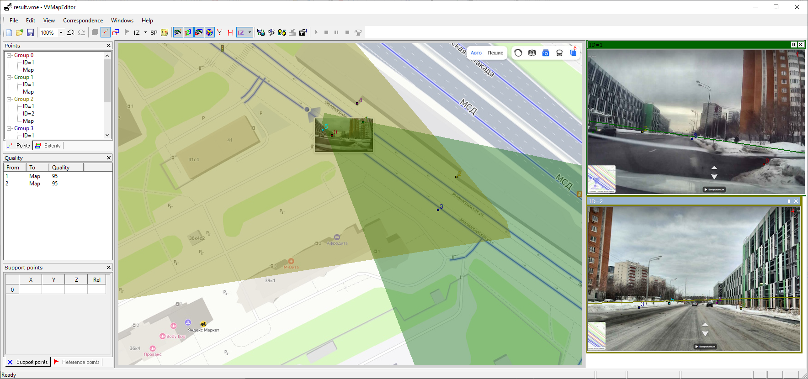

# Video-to-Video-to-Map Correspondence Editor

VVMapEditor is an application which builds correspondence between camera placements/directions and the map basing on pivot points placed on camera images and the map.

## Main steps

- Load the map image file.
- Load camera images/videos.
- Place pivot points: add a point onto a camera image, place (where you suppose the point is) it on the map. Optionally do the same with the other cameras.
- Add more points (3 is minimum)
- Press Compile button
- A camera projection frustrum is drawn on the map. Horizon lines are drawn on the camera images.

